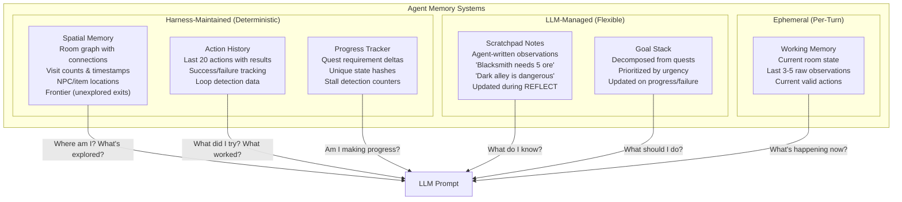
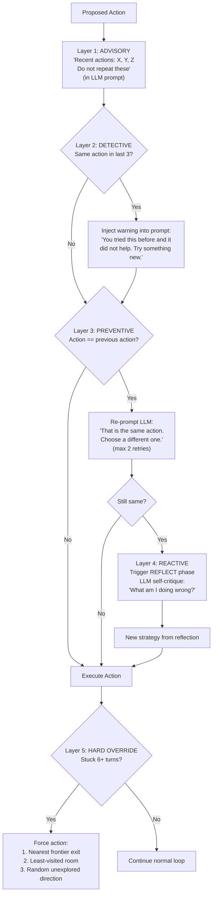

# AI Agent for Playing RPG Games - Deep Analysis

## Table of Contents
1. [How the Current Replay System Works](#1-how-the-current-replay-system-works)
2. [Identified Gaps and Weaknesses](#2-identified-gaps-and-weaknesses)
3. [Research: How Other Systems Solve This](#3-research-how-other-systems-solve-this)
4. [Recommended Architecture](#4-recommended-architecture)
5. [Anti-Stall Mechanisms](#5-anti-stall-mechanisms)
6. [Feature Coverage Matrix](#6-feature-coverage-matrix)

---

## 1. How the Current Replay System Works

### Overview

`GameReplay.cs` (342 lines) is an automated AI player that drives the game loop by generating player commands via LLM, feeding them through the full `GameMaster.ProcessPlayerActionAsync()` pipeline, and logging the session to markdown.

### Architecture: Three LLM Calls Per Turn

```
Turn N:
  1. GameReplay calls LLM → "What should the player do?" → single action string
  2. GameMaster.DecideActionsAsync calls LLM → parse action into ActionPlan JSON
  3. GameMaster.NarrateWithResultsAsync calls LLM → narrative prose
  (+ additional calls if NPC dialogue is triggered)
```

The replay bot and GameMaster have **independent LLM sessions** — the bot generates a natural language command, then GameMaster re-parses it through its own LLM decision system. This means 3+ LLM round-trips per turn minimum.

### State Tracking

| Field | Type | What It Tracks |
|---|---|---|
| `_visitedRooms` | `HashSet<string>` | Room IDs the bot has entered |
| `_talkedToNpcs` | `HashSet<string>` | NPC IDs the bot has spoken to |
| `_recentActions` | `List<string>` | Rolling window of last 8 raw action strings |
| `_turnsSinceExplored` | `int` | Turns since last movement (resets on move) |
| `_turnsSinceCombat` | `int` | Turns since last combat — **tracked but never used** |

### The Decision Engine: `GeneratePlayerActionAsync()`

Each turn, the bot builds a rich context prompt with:

**Data collected from GameState:**
- All exits (classified as visited/unvisited)
- All NPCs in room (classified as enemy/ally/fresh-ally)
- Player inventory with quantities
- Floor items
- Active quest summaries
- Health percentage and status (CRITICAL/LOW/OK)
- Healing consumables available

**NPC Classification Logic:**
```
Enemy = Role is Warrior or Boss, OR Alignment is Evil
Ally  = Alive AND NOT enemy
Fresh = Ally AND not in _talkedToNpcs
```

**Strategic Hints (in priority order):**

| Priority | Condition | Hint Given |
|---|---|---|
| 1 (highest) | In combat mode | "Use `auto` or `attack [name]`" |
| 2 | Enemies visible (not in combat) | "Attack the first enemy" |
| 3a | Health < 25% + has healing | "Use a healing item" |
| 3b | Health < 25% + no healing | "Flee" |
| 4 | Items on floor | "Pick them up" |
| 5 | Active quests exist | "Work toward quest objectives" |
| 6 | Unvisited exits available | "PRIORITISE exploring these" |
| 7 | Fresh allies present | "Talk to them" |
| 8 | `_turnsSinceExplored > 3` | "Move somewhere" |

**System message:**
> "You are an expert RPG player making smart decisions in a {Style} game. You prioritise: (1) surviving combat, (2) completing quests, (3) exploring new areas, (4) collecting useful items, (5) gathering information from NPCs. Always respond with a SINGLE short action command. Never explain your reasoning."

**Behaviour rules sent to LLM:**
1. Always attack enemies on sight
2. Use `auto` when in combat
3. Explore ALL unvisited exits first
4. Pick up items on floor
5. Talk to each NPC only ONCE
6. Flee if health critical and no healing
7. Never repeat same action twice in a row

**Response parsing:**
- Takes only first line of LLM response
- Strips preamble prefixes (`"action:"`, `"i will"`, `"player:"`, `"> "`)
- Truncates to 200 characters

**Fallback on LLM failure** (catches all exceptions silently):
1. In combat → `"auto"`
2. Enemies visible → `"attack {first enemy name}"`
3. Unvisited exits → `"go {first unvisited exit}"`
4. Any exits → `"go {first exit}"`
5. Default → `"look around"`

### Turn Loop End Conditions

| Condition | Detection Method |
|---|---|
| **Victory** | `_game.WinConditionRoomIds?.Contains(currentRoomId)` — room-based only |
| **Death** | `_gameState.Player.Health <= 0` |
| **Timeout** | `turn >= maxTurns` (default 50) |

### Logging

Outputs a markdown file (`REPLAY_{game}.md`) with:
- Game header (title, style, date, description, objective)
- Per-turn sections (location, health, exits, NPCs, inventory, action, narrator response)
- End summary (Victory/Game Over/Timeout)
- Timestamp footer

---

## 2. Identified Gaps and Weaknesses

### Critical Gaps

#### 2.1 Incomplete Win Condition Detection
GameReplay only checks `WinConditionRoomIds` (the legacy room-based system). GameMaster's `CheckWinCondition()` supports **four** types: `room`, `item`, `npc_defeat`, `quest_complete`. A game that wins on defeating a boss or collecting an item will **never** trigger the victory break in replay mode — it runs until `maxTurns`.

Even worse: GameMaster *does* detect these wins and embeds victory text in the narration response, but GameReplay doesn't parse the response for victory signals.

#### 2.2 No Crafting Awareness
The bot never issues `craft`, `recipes`, or `gather` commands. No strategic hints exist for crafting. If a game requires crafting to progress (e.g., forge a key to open a door), the bot **cannot complete it**.

#### 2.3 No Economy/Shopping Awareness
The bot never issues `buy`, `sell`, or `shop` commands. No hints for merchants. It doesn't check currency or consider purchasing healing items when low on health and near a merchant.

#### 2.4 No Equipment Management
The bot never issues `equip` or `unequip`. If it picks up a powerful weapon, it fights with bare fists. There is no hint suggesting equipment management.

#### 2.5 No Dead NPC Looting
No hint about examining or looting dead NPC bodies. After defeating an enemy with valuable loot (shown by ☠️💰), the bot walks away unless the LLM happens to decide otherwise.

### Moderate Gaps

#### 2.6 Dead Code: `_turnsSinceCombat`
Tracked every turn but never referenced in any hint, decision, or fallback. Entirely unused.

#### 2.7 No Backtracking Strategy
When all exits from the current room are visited, the bot has no strategy for which previously-visited room might have unexplored branches. It picks the first exit arbitrarily. There is no concept of a "frontier" — known-but-unexplored exits reachable through visited rooms.

#### 2.8 No Narrative Response Parsing
The bot discards the narrator's response entirely. If the narrator says "you found a hidden passage" or "the merchant offers you a quest", the bot doesn't extract that information. It only uses structured GameState.

#### 2.9 Quest Progress Is Display-Only
The bot sees quest summaries in its prompt but cannot make strategic decisions based on quest requirements (e.g., "I need 3 more iron ore — let me go to the cave to gather").

#### 2.10 No Healer NPC Awareness
When health is low and there are no consumables, the bot's only option is "flee". It doesn't know to seek out Healer-role NPCs.

### Minor Gaps

#### 2.11 Fragile NPC Talk Tracking
Uses substring matching on NPC names. An NPC named "Al" would match any action containing "al" (like "talk to Aldric").

#### 2.12 Exit Description Fallback
When exit descriptions are null, the prompt shows raw IDs like `"tavern_upstairs"`, leaking implementation details to the LLM.

#### 2.13 Narration Style Mismatch
GameMaster's narration prompt is hardcoded as "fantasy RPG narrator" regardless of the game's actual style. A sci-fi game gets fantasy framing.

#### 2.14 No Programmatic Anti-Loop Enforcement
The "DO NOT repeat these" instruction is advisory. The LLM can ignore it. There is no code that checks and blocks duplicate actions.

#### 2.15 Silent Exception Swallowing
The `catch` block in `GeneratePlayerActionAsync` catches all exceptions with no logging. Failed LLM calls are invisible in the replay log.

#### 2.16 Guard Role Not Treated as Enemy
`Guard` role NPCs are classified as allies unless they have `Evil` alignment. A hostile guard would not be attacked proactively.

#### 2.17 3+ LLM Calls Per Turn
The replay bot generates a natural language command, then GameMaster re-parses it. This is redundant — the bot could generate structured ActionPlans directly, skipping the DecideActionsAsync step.

---

## 3. Research: How Other Systems Solve This

### 3.1 Academic Frameworks

**Microsoft TextWorld / Jericho / TALES Benchmark:**
- TextWorld generates parameterized text games for agent training
- Jericho provides a "valid action handicap" — reveals which actions the game parser accepts
- TALES (2025) found that **even top LLM agents fail to achieve 15% scores** on human-designed text games, despite strong performance on synthetic ones
- Key insight: The action space problem is the hardest part — knowing *what you can do* matters more than knowing *what you should do*

**TextQuests (2025):**
- Benchmarked 25 classic Infocom games with LLMs
- Critical finding: As context length grows, LLMs show **increased tendency to repeat actions from history** rather than synthesizing novel plans
- LLMs hallucinate about past actions — believing they dropped an item in the wrong room, or already picked something up when they haven't

### 3.2 Key Agent Architectures from Research

#### CALM — Contextual Action Language Model (EMNLP 2020)
Two-stage architecture:
1. A language model generates a compact set of **candidate actions** given game context
2. A separate scoring model **re-ranks** candidates by expected value

Achieved 69% improvement over prior state-of-the-art. **Takeaway: Separate action generation from action selection.** Even a simple scoring step on top of LLM-generated candidates dramatically improves results.

#### AriGraph — Knowledge Graph + Episodic Memory (IJCAI 2025)
At each timestep:
1. Add a new **episodic vertex** containing the full observation
2. LLM parses the observation to extract relationship triplets into a **semantic memory graph**
3. Agent queries this graph for planning ("where did I last see the key?")

Significantly outperformed all baselines. **Takeaway: Building an explicit knowledge graph from game observations — even a simple one — dramatically outperforms raw context window approaches.**

#### LPLH — Learning to Play Like Humans (ACL 2025)
Three modules:
1. **Dynamic Knowledge Graph Map Building** — incrementally constructs a spatial model
2. **Action Space Learning** — remembers which verbs/actions actually work in the game
3. **Experience Reflection** — synthesizes prior successes/failures into reusable summaries

**Takeaway: Track which actions actually work and feed that back. Don't just prompt the LLM with all theoretically possible actions.**

#### Reflexion — Verbal Reinforcement Learning (2023)
Three components:
1. **Actor**: Generates actions
2. **Evaluator**: Scores the trajectory
3. **Self-Reflection**: LLM generates verbal feedback ("I failed because I didn't pick up the key before trying to open the door") stored in episodic memory

On subsequent trials, the agent reads its own reflection notes. **Takeaway: After failures or stalls, have the LLM write a post-mortem. Feed it into subsequent decisions.**

#### ReAct — Reasoning + Acting (2022)
Format each turn as explicit reasoning then action:
```
Thought: I need to find the key. The merchant mentioned it was in the cellar.
         I haven't explored the cellar yet.
Action: go cellar
```
On ALFWorld, ReAct outperformed RL methods by 34% absolute success rate. **Takeaway: Requiring explicit reasoning before each action reduces impulsive/random actions.**

### 3.3 Practical LLM Agent Experiments

**Fernando Borretti's "Letting Claude Play Text Adventures":**
- The most practical documented experiment with LLMs playing interactive fiction
- **Perceptual Working Memory**: Show only the last N turns (he used 5) of raw output — prevents context bloat
- **Semantic Memory (Scratchpad)**: A list of strings the agent can append to/remove from. Agent writes notes like "The garden well is a dead end" or "Need brass key for tower door." In practice, Claude only ever appended, never deleted entries.
- **Automatic Geography**: The *harness* (not the LLM) parses game output and builds a room graph. This is far more reliable than asking the LLM to maintain its own map.
- **Key finding**: Claude got fixated on a red-herring room, repeatedly trying to climb a well, going in circles. It eventually noticed the pattern in its own memory notes and broke out — but only because the scratchpad made the repetition visible.
- **Bottleneck**: Context window cost — by day two of gameplay, each turn cost tens of thousands of input tokens.

**AdventureGPT (text-adventure-agent project):**
- Checks `recent_actions[-2:]` for repeated pairs as an explicit anti-loop mechanism
- Maintains a "wasted move counter" that increments when the same 2-word action prefix repeats
- Uses frontier-based exploration — maintains a list of known-but-unexplored exits

### 3.4 Key Patterns Across All Research

#### Memory Is the #1 Factor
Every successful system uses structured memory beyond raw conversation history:
- **Short-term**: Last N turns of raw observations (working memory)
- **Long-term**: Knowledge graph or scratchpad of persistent facts
- **Episodic**: Record of what happened in specific past situations
- **Spatial**: Map of rooms and connections (maintained by harness, not LLM)

#### The Harness Should Own the State
Since this project owns the game engine, the agent harness can provide **perfect structured state** to the LLM:
- Exact room connections (not LLM-remembered)
- Exact inventory (not LLM-recalled)
- Exact NPC status (not LLM-estimated)
- Exact quest progress (not LLM-summarized)

This bypasses the #1 failure mode (state hallucination) entirely.

#### Action Space Pruning Is Critical
Don't show the agent 40+ possible actions. Show only what's **currently valid**:
- In combat: `attack`, `auto`, `flee`, `use [healing items]`, `status`
- In a merchant's shop: `buy`, `sell`, `shop`, `talk`, `leave`
- Exploring: `go [exits]`, `take [items]`, `talk [NPCs]`, `examine [objects]`

#### Anti-Loop Needs Multiple Layers
No single mechanism prevents loops:
1. **Advisory** (current): "Don't repeat" in prompt — LLM can ignore
2. **Detective**: Code checks recent actions for patterns
3. **Preventive**: Filter out recently-used actions from the valid set
4. **Reactive**: When loop detected, trigger a reflection/replanning step

---

## 4. Recommended Architecture

### 4.1 Agent State Machine

```
                    ┌──────────┐
                    │  OBSERVE  │ ← Get structured state from GameState
                    └────┬─────┘
                         │
                    ┌────▼─────┐
                    │ REMEMBER  │ ← Retrieve scratchpad + frontier + knowledge
                    └────┬─────┘
                         │
                    ┌────▼──────┐
                    │  DETECT   │ ← Check for loops, stalls, danger
                    └────┬──────┘
                         │
                    ┌────▼─────┐
                    │  REASON   │ ← LLM: Thought → Plan → Action (ReAct)
                    └────┬─────┘
                         │
                    ┌────▼─────┐
                    │   ACT     │ ← Execute through GameMaster
                    └────┬─────┘
                         │
                    ┌────▼──────┐
                    │  REFLECT  │ ← On failure/stall: LLM writes post-mortem
                    └────┬──────┘
                         │
                    ┌────▼──────┐
                    │  UPDATE   │ ← Update scratchpad, frontier, visited sets
                    └────┬──────┘
                         │
                    ┌────▼──────┐
                    │  PROGRESS │ ← Evaluate against goals; replan if stalled
                    └──────────┘
```

### 4.2 Memory Systems the Agent Needs

#### Spatial Memory (Harness-Maintained)
```csharp
class SpatialMemory {
    Dictionary<string, RoomNode> KnownRooms;      // rooms we've visited
    HashSet<FrontierExit> Frontier;                // known exits we haven't taken
    List<string> PathHistory;                      // ordered room visit history

    // "I know the cave is 2 rooms north of the tavern"
    List<string> FindPathTo(string targetRoomId);

    // "What haven't I explored yet?"
    List<FrontierExit> GetUnexploredExits();

    // "Where was the blacksmith?"
    string? FindRoomContainingNpc(string npcId);
}

class RoomNode {
    string RoomId;
    string Name;
    int VisitCount;
    int LastVisitedTurn;
    List<ExitEdge> Exits;        // known connections
    List<string> NpcsSeen;       // NPCs observed here
    List<string> ItemsSeen;      // items observed on floor
    bool HasMerchant;
    bool HasCrafter;
    bool HasHealer;
}

class FrontierExit {
    string FromRoomId;
    string ExitName;
    string DestinationRoomId;    // if known
    int DiscoveredOnTurn;
}
```

#### Scratchpad Memory (Agent-Written)
A list of string notes the LLM can add to during the REFLECT phase:
```
- "The blacksmith in the tavern can forge weapons — needs iron ore"
- "The goblin king drops a crown key — needed for the throne room"
- "The dark forest is very dangerous at low health"
- "Merchant in marketplace sells health potions for 10 gold"
```

#### Action History (Harness-Maintained)
```csharp
class ActionHistory {
    List<ActionRecord> AllActions;

    // Anti-loop queries
    bool IsRepeating(string action, int windowSize = 3);
    int ConsecutiveSameRoomTurns();
    bool HasTriedAndFailed(string action, int recentTurns = 5);
    List<string> GetRecentUniqueActions(int count = 8);
}

class ActionRecord {
    int Turn;
    string RoomId;
    string Action;
    bool Succeeded;
    string ResultSummary;
}
```

#### Goal Stack (Harness + LLM)
```csharp
class GoalStack {
    List<Goal> Goals;            // ordered by priority

    // "My main quest is to find the crown. To do that I need to
    //  defeat the goblin king. To reach him I need to explore the cave."
    void PushGoal(Goal goal);
    Goal? GetCurrentGoal();
    void CompleteGoal(string goalId);
    bool IsStalled(int turnsSinceProgress);
}

class Goal {
    string Id;
    string Description;
    GoalType Type;               // Explore, Kill, Collect, Craft, Talk, Reach
    string? TargetId;
    int? TargetQuantity;
    int CurrentProgress;
    int CreatedOnTurn;
    int LastProgressTurn;
}
```

### 4.3 The Improved Decision Prompt

Instead of the current flat hint list, use a structured ReAct-style prompt:

```
== CURRENT STATE ==
Location: Dark Forest (visited 2 times, last on turn 5)
Exits: north → Goblin Cave (UNEXPLORED), south → Forest Entrance (visited 3x)
NPCs: Goblin Scout (Enemy, HP: 15/15, Str: 8)
Floor Items: rusty dagger
Inventory: Iron Sword, Health Potion x2, Iron Ore x3
Equipped: Iron Sword (main_hand), Leather Armor (chest)
Health: 72/100 (OK)
Currency: 45 gold, 20 silver

== ACTIVE GOALS (priority order) ==
1. [Quest] "Defeat the Goblin King" — find him in the goblin cave
2. [Explore] Visit the Goblin Cave (north exit, unexplored)
3. [Craft] Forge steel sword at blacksmith (need 2 more iron ore)

== SPATIAL MEMORY ==
Known rooms: Town Square, Tavern, Forest Entrance, Dark Forest
Frontier (unexplored exits): Goblin Cave (north from here), Mountain Pass (east from Town Square)
Blacksmith location: Tavern
Merchant location: Town Square (sells health potions: 10g)
Healer location: none known

== SCRATCHPAD NOTES ==
- Blacksmith needs 5 iron ore + 25 gold for steel sword (have 3 ore, 45 gold)
- Goblin King is in the deepest part of the cave
- Forest has gatherable iron ore (found 2 last time)

== RECENT ACTIONS (last 5) ==
T8: "go dark forest" → moved to Dark Forest ✓
T7: "gather ore" → found 2 iron ore ✓
T6: "go forest entrance" → moved to Forest Entrance ✓
T5: "talk to ranger" → learned about goblin cave ✓
T4: "buy health potion" → purchased for 10 gold ✓

== VALID ACTIONS RIGHT NOW ==
Combat: attack goblin scout, auto
Items: take rusty dagger, use health potion, examine goblin scout
Movement: go north (Goblin Cave - UNEXPLORED), go south (Forest Entrance)
Info: look, status, inventory, quests

== THINK STEP BY STEP ==
1. What is my current goal?
2. What's the best action to progress toward it?
3. Are there any immediate threats or opportunities?
4. Am I about to repeat a recent action?

Respond with EXACTLY:
Thought: [your reasoning]
Action: [single game command]
```

### 4.4 When to Trigger Reflection

The agent enters a **REFLECT** phase (separate LLM call) when:
1. **Loop detected**: Same action attempted 2+ times in last 4 turns
2. **Stalled**: No new room visited and no quest progress in 5+ turns
3. **Failed action**: An action returned `Success = false`
4. **Near death**: Health dropped below 25%
5. **Post-combat**: Just finished a combat encounter (assess situation)

Reflection prompt:
```
You just played several turns. Here's what happened:
[last 5 turn summaries]

Your current goals are:
[goal stack]

Reflect on your progress:
1. What went well?
2. What went wrong or got stuck?
3. What should you try differently?
4. Add any notes to your scratchpad.
5. Should you change or reprioritize your goals?

Respond as JSON:
{
  "notes": ["new scratchpad entries"],
  "removeNotes": ["outdated entries to remove"],
  "goalChanges": [{"action": "add|remove|reprioritize", "goal": "..."}],
  "nextStrategy": "brief description of what to do next"
}
```

### 4.5 Direct ActionPlan Generation (Skip Double-Parsing)

The current system has the replay bot generate a natural language command, then GameMaster re-parses it through LLM. This is wasteful. Instead:

**Option A**: Have the replay bot generate `ActionPlan` JSON directly, then call `ApplyActionAsync` and `NarrateWithResultsAsync` — skipping `DecideActionsAsync` entirely. This saves one LLM call per turn.

**Option B**: Expose a `GameMaster.ExecuteActionPlanAsync(ActionPlan)` method that takes a pre-decided action and runs steps 2+3 only.

---

## 5. Anti-Stall Mechanisms

### 5.1 Multi-Layer Anti-Loop System

```
Layer 1 — ADVISORY (in prompt):
  "Your recent actions were: X, Y, Z. Do not repeat these."

Layer 2 — DETECTIVE (in harness):
  if (last 3 actions contain duplicates) → inject warning into prompt
  if (same room for 4+ turns without combat) → flag as "stuck"

Layer 3 — PREVENTIVE (in harness):
  Filter recently-failed actions from the "valid actions" list
  If action == previousAction: re-prompt with "You just did that. Choose differently."

Layer 4 — REACTIVE (reflection trigger):
  If stuck flag is true → trigger REFLECT phase before next action
  If reflection already happened and still stuck → force exploration fallback

Layer 5 — HARD OVERRIDE (deterministic fallback):
  If stuck for 6+ turns → pick first frontier exit and go there
  If no frontier exits → random walk with bias toward least-visited rooms
  If all rooms visited and no quests progressing → trigger "bored" exploration
```

### 5.2 Progress Metrics

Track these to detect stalls:

| Metric | How to Measure | Stall Threshold |
|---|---|---|
| **New rooms visited** | `_visitedRooms.Count` delta per 5 turns | 0 new rooms in 5 turns |
| **Quest progress** | Sum of `QuestRequirement.CurrentProgress` | No change in 5 turns |
| **Inventory changes** | Items gained or used | No change in 5 turns |
| **Combat victories** | NPCs defeated count | N/A (not always relevant) |
| **Unique states** | Hash of `(roomId, inventoryHash)` | No new state in 4 turns |
| **Novel actions** | Actions not in last-8 window | 0 novel actions in 3 turns |

### 5.3 Frontier-Based Exploration

Instead of the current "go to first exit" fallback, maintain a proper frontier:

```
Every time the bot enters a room:
  1. Mark room as visited
  2. For each exit in this room:
     a. If destination is NOT in visitedRooms → add to Frontier
     b. If destination IS in visitedRooms → remove from Frontier

When choosing where to explore:
  1. Get all frontier exits
  2. Sort by: distance from current room (BFS on known graph)
  3. Pick the nearest unexplored exit
  4. Generate a path to reach it (through known rooms)
  5. Execute movement commands along the path
```

This ensures systematic exploration even when the nearest unexplored exit is several rooms away.

### 5.4 Intelligent Backtracking

When the bot is in a dead-end or fully-explored area:

```
1. Check Frontier for nearest unexplored exit
2. If frontier is empty:
   a. Check for locked doors/blocked exits that might now be passable
   b. Check if any quest requirements suggest a location
   c. Check scratchpad for NPC hints about locations
3. Use BFS on spatial memory to find shortest path to target
4. Execute movement commands step by step
```

---

## 6. Feature Coverage Matrix

### Current Coverage vs. Recommended

| Game Feature | Current Bot | Needed For Complete Coverage |
|---|---|---|
| **Movement/Exploration** | ✅ Basic (first unvisited exit) | Frontier-based, pathfinding, backtracking |
| **Combat — Attack** | ✅ Attacks enemies on sight | ✅ Works well |
| **Combat — Auto** | ✅ Uses auto when in combat | ✅ Works well |
| **Combat — Flee** | ✅ Flees when health < 25% | + Flee to healer/merchant for recovery |
| **NPC Talk** | ✅ Talks to each NPC once | + Strategic questioning, extract info to scratchpad |
| **Take Items** | ✅ Picks up floor items | + Loot dead NPCs, prioritize useful items |
| **Examine** | ❌ Never examines | Examine NPCs (see loot), examine items (see stats) |
| **Equip/Unequip** | ❌ Never equips | Auto-equip best weapon/armor after pickup |
| **Use Items** | ⚠️ Only healing when prompted | + Teleportation items, buff consumables |
| **Buy/Sell/Shop** | ❌ Never shops | Buy healing when low, sell junk, buy upgrades |
| **Crafting** | ❌ Never crafts | Check recipes, gather materials, request crafting |
| **Gathering** | ❌ Never gathers | Gather when in resource-rich rooms + need materials |
| **Quests** | ⚠️ Shows in prompt only | Track requirements, plan actions toward completion |
| **Follow** | ❌ Never recruits | Recruit allies for combat support |
| **Give** | ❌ Never gives items | Give quest items to NPCs, trade with allies |
| **Economy** | ❌ Unaware of currency | Track gold, buy/sell decisions, loot currency |
| **Equipment** | ❌ Unaware of gear | Compare stats, equip upgrades, manage slots |
| **Win Conditions** | ⚠️ Room-based only | All 4 types: room, item, npc_defeat, quest_complete |
| **Anti-Loop** | ⚠️ Advisory only | Multi-layer: detect + prevent + react |
| **Backtracking** | ❌ No pathfinding | BFS on known map, path to frontier exits |
| **Reflection** | ❌ No self-assessment | Post-failure analysis, strategy adjustment |
| **Memory** | ⚠️ Visited rooms only | Spatial graph + scratchpad + action history + goals |

### Priority Implementation Order

**Phase 1 — Critical Fixes (make the bot competent):**
1. Fix win condition detection (all 4 types)
2. Add equipment management (auto-equip on pickup)
3. Add dead NPC looting (examine + take after combat)
4. Add programmatic anti-loop (block duplicate actions)
5. Add economy commands (buy healing, shop awareness)

**Phase 2 — Strategic Intelligence (make the bot smart):**
6. Implement spatial memory with frontier tracking
7. Add ReAct-style reasoning (Thought + Action format)
8. Implement goal stack from quest requirements
9. Add valid-action filtering (context-sensitive action list)
10. Add reflection on stall detection

**Phase 3 — Full Feature Coverage (make the bot complete):**
11. Crafting awareness (recipes, gathering, material tracking)
12. NPC relationship tracking (who told me what)
13. Scratchpad memory (agent-written notes)
14. Strategic NPC conversation (targeted questions)
15. Companion recruitment when beneficial

**Phase 4 — Advanced Capabilities (make the bot excellent):**
16. Multi-candidate action scoring (generate 3 options, pick best)
17. Skip double-LLM-parsing (generate ActionPlans directly)
18. Adaptive difficulty (adjust aggression based on combat outcomes)
19. Post-session reflection log (what worked, what didn't)
20. Cross-session learning (remember strategies from previous replays)

---

## Appendix: Key Research References

| Source | Key Insight |
|---|---|
| **CALM** (EMNLP 2020) | Separate action generation from selection — scoring layer on top of LLM |
| **AriGraph** (IJCAI 2025) | Knowledge graphs dramatically outperform raw context for game state |
| **LPLH** (ACL 2025) | Track which actions actually work; learn the game's vocabulary |
| **Reflexion** (2023) | Verbal self-reflection as reinforcement; post-mortems improve next attempt |
| **ReAct** (2022) | Explicit reasoning before acting reduces impulsive/random actions |
| **TALES** (2025) | Even top LLMs score <15% on human-designed text games |
| **TextQuests** (2025) | LLMs hallucinate past actions; repetition increases with context length |
| **Borretti's experiment** | Scratchpad memory + harness-maintained map = most practical approach |
| **AdventureGPT** | Recent-action-pair checking for anti-loop; frontier-based exploration |
| **Tree of Thoughts** (2023) | Multi-candidate evaluation for critical decision points |

---

## Diagrams

### Current System Flow

```mermaid
flowchart TB
    subgraph Current["Current GameReplay Architecture"]
        Turn["Turn Start"]
        Observe["Read GameState:<br/>room, exits, NPCs, inventory"]
        Classify["Classify NPCs:<br/>enemy vs ally"]
        Hints["Build hint list<br/>(8 priority levels)"]
        LLM1["LLM Call #1:<br/>Generate player action<br/>(natural language)"]
        GM["GameMaster.ProcessPlayerActionAsync()"]
        LLM2["LLM Call #2:<br/>DecideActionsAsync<br/>(parse to ActionPlan JSON)"]
        Execute["ApplyActionAsync<br/>(deterministic execution)"]
        LLM3["LLM Call #3:<br/>NarrateWithResultsAsync<br/>(generate prose)"]
        Log["Log to markdown"]
        Check["Check win/death/timeout"]

        Turn --> Observe --> Classify --> Hints --> LLM1
        LLM1 --> GM --> LLM2 --> Execute --> LLM3 --> Log --> Check
        Check -->|Continue| Turn
    end
```



### Recommended System Flow

```mermaid
flowchart TB
    subgraph Recommended["Recommended Agent Architecture"]
        Turn["Turn Start"]

        subgraph ObservePhase["OBSERVE"]
            State["Structured GameState"]
            Spatial["Query Spatial Memory<br/>(known map, frontier)"]
            Goals["Query Goal Stack<br/>(current objectives)"]
            Notes["Query Scratchpad<br/>(agent's own notes)"]
        end

        subgraph DetectPhase["DETECT"]
            LoopCheck["Loop detection<br/>(duplicate action check)"]
            StallCheck["Stall detection<br/>(progress metrics)"]
            DangerCheck["Danger detection<br/>(health, combat odds)"]
        end

        subgraph ReasonPhase["REASON (ReAct)"]
            ValidActions["Filter valid actions<br/>for current context"]
            Prompt["Build structured prompt:<br/>state + memory + goals +<br/>valid actions + warnings"]
            LLM["LLM: Thought → Action<br/>(single call)"]
        end

        subgraph ActPhase["ACT"]
            Direct["Execute ActionPlan<br/>directly via ApplyActionAsync<br/>(skip DecideActionsAsync)"]
            Narrate["NarrateWithResultsAsync<br/>(if needed)"]
        end

        subgraph ReflectPhase["REFLECT (conditional)"]
            Trigger{"Stall or<br/>failure?"}
            Reflect["LLM reflection:<br/>What went wrong?<br/>Update scratchpad & goals"]
        end

        subgraph UpdatePhase["UPDATE"]
            UpdateMap["Update spatial memory"]
            UpdateFrontier["Update frontier exits"]
            UpdateHistory["Update action history"]
            UpdateGoals["Update goal progress"]
            AutoActions["Auto-actions:<br/>equip best gear,<br/>loot dead NPCs"]
        end

        Turn --> ObservePhase --> DetectPhase --> ReasonPhase --> ActPhase
        ActPhase --> Trigger
        Trigger -->|Yes| Reflect --> UpdatePhase
        Trigger -->|No| UpdatePhase
        UpdatePhase --> Turn
    end
```



### Memory Architecture



### Anti-Loop Defense Layers


