# C# RPG Backend - Architecture Diagrams

## 1. High-Level System Architecture

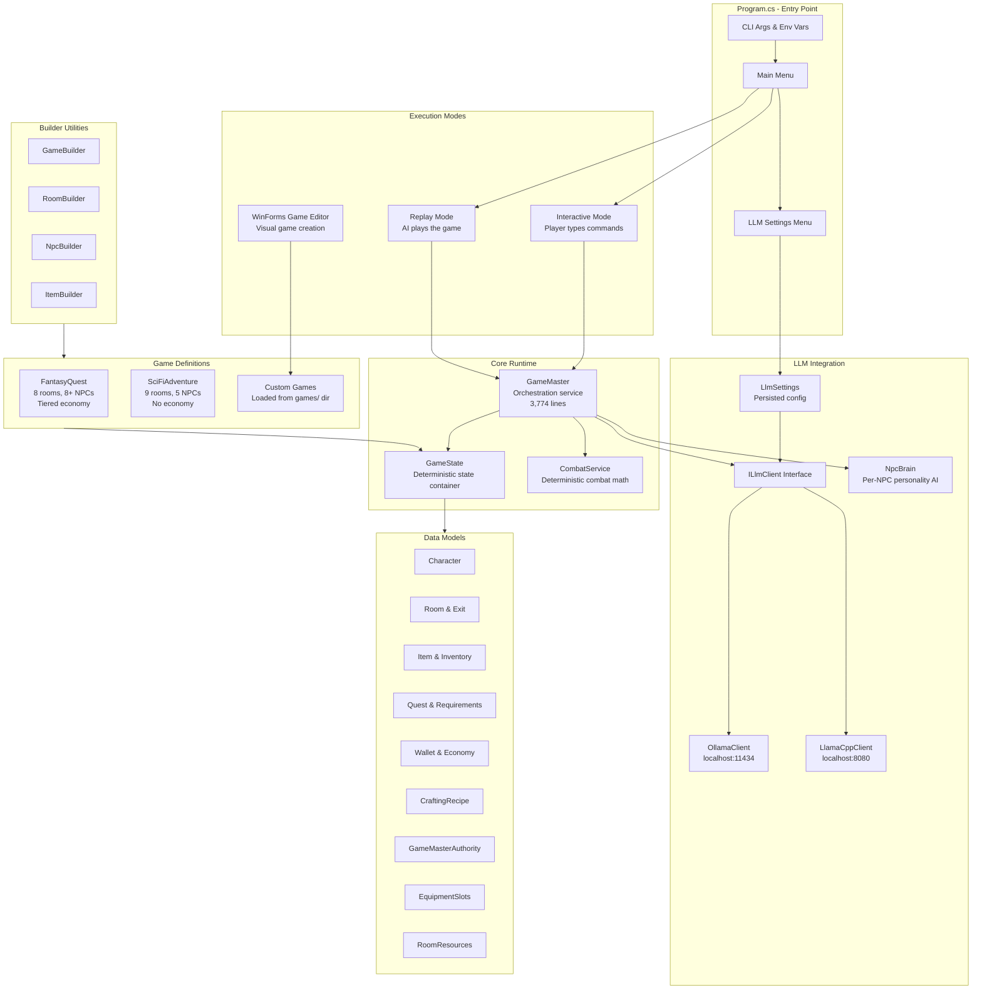

---

## 2. Two-Step LLM Game Loop (Core Architecture)

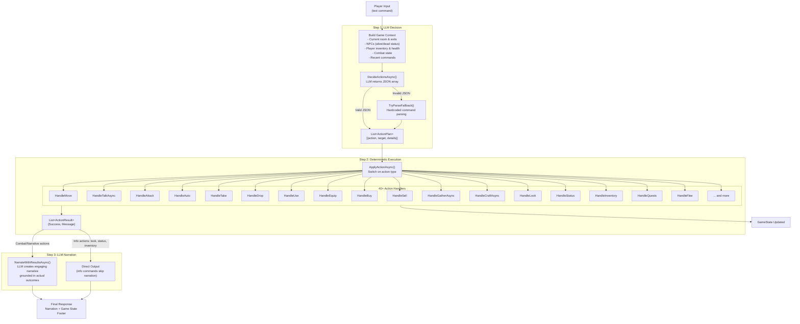

---

## 3. AI Replay System (How AI Plays the Game)

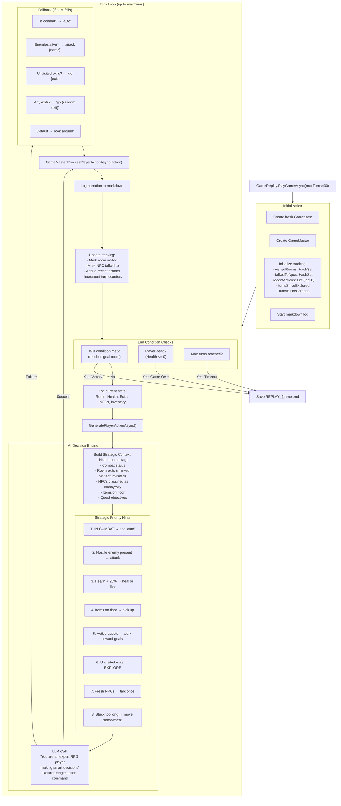

---

## 4. Data Model Relationships

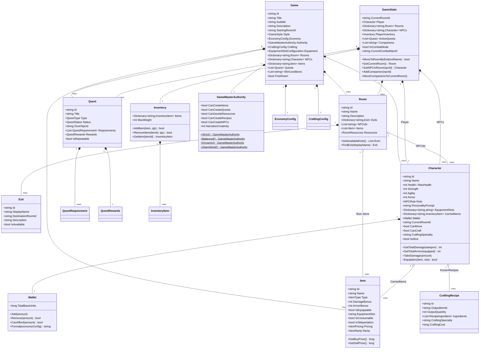

---

## 5. LLM Integration Architecture

```mermaid
flowchart TB
    subgraph Config["Configuration Layer"]
        LlmSettings["LlmSettings<br/>llm-settings.json<br/>- Backend: ollama | llamacpp<br/>- Model: granite4:3b<br/>- URLs & context size"]
        LlmSettings -->|CreateClient()| Factory["Factory Method"]
    end

    subgraph Interface["ILlmClient Interface"]
        ChatAsync["ChatAsync(messages, model)<br/>→ string"]
        ChatStreamAsync["ChatStreamAsync(messages, model)<br/>→ IAsyncEnumerable&lt;string&gt;"]
        IsHealthy["IsHealthyAsync() → bool"]
        ListModels["ListModelsAsync() → List&lt;string&gt;"]
    end

    subgraph OllamaImpl["OllamaClient"]
        OllamaHTTP["POST /api/chat<br/>localhost:11434"]
        OllamaModels["GET /api/tags"]
        OllamaReq["OllamaChatRequest<br/>{Model, Messages, Stream,<br/>Options: {NumCtx: 8192}}"]
    end

    subgraph LlamaCppImpl["LlamaCppClient"]
        LlamaHTTP["POST /v1/chat/completions<br/>OpenAI-compatible API<br/>localhost:8080"]
        LlamaHealth["GET /health"]
        LlamaModels["GET /v1/models"]
        subgraph ServerMgmt["Server Lifecycle"]
            FindExe["FindLlamaServerExe()<br/>Search PATH & common dirs"]
            FindModel["FindOllamaModelPath()<br/>Read Ollama manifests<br/>→ GGUF blob path"]
            Launch["LaunchServer(model, port, ctx)<br/>Spawn llama-server process"]
            Stop["StopServer()<br/>Kill tracked process"]
        end
    end

    subgraph Callers["LLM Call Points in Codebase"]
        GM_Decide["GameMaster.DecideActionsAsync()<br/>→ JSON action array"]
        GM_Narrate["GameMaster.NarrateWithResultsAsync()<br/>→ Narrative text"]
        NPC_Talk["NpcBrain.RespondToPlayerAsync()<br/>→ NPC dialogue"]
        NPC_Intent["NpcBrain.GetIntentAsync()<br/>→ NPC intent JSON"]
        GM_Follow["GetNpcFollowDecisionAsync()<br/>→ Follow decision"]
        GM_Give["GetNpcGiveDecisionAsync()<br/>→ Accept/reject items"]
        GM_Gather["TryDynamicGatherAsync()<br/>→ Resource availability"]
        Replay_AI["GameReplay.GeneratePlayerActionAsync()<br/>→ Next player action"]
    end

    Factory -->|"ollama"| OllamaImpl
    Factory -->|"llamacpp"| LlamaCppImpl

    OllamaImpl -.->|implements| Interface
    LlamaCppImpl -.->|implements| Interface

    Callers -->|via ILlmClient| Interface

    subgraph MessageFormat["Chat Message Format"]
        Msg["ChatMessage<br/>Role: system | user | assistant<br/>Content: string"]
        Conv["Conversation = List&lt;ChatMessage&gt;<br/>[system prompt, ...history, user msg]"]
    end
```

---

## 6. Combat System

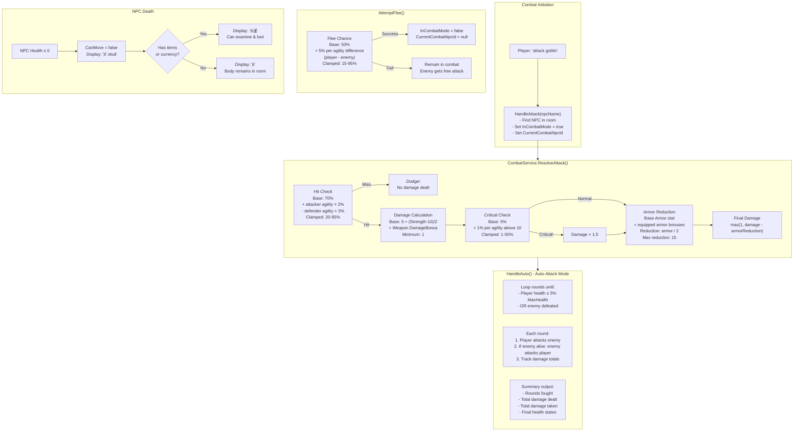

---

## 7. Economy & Trading System

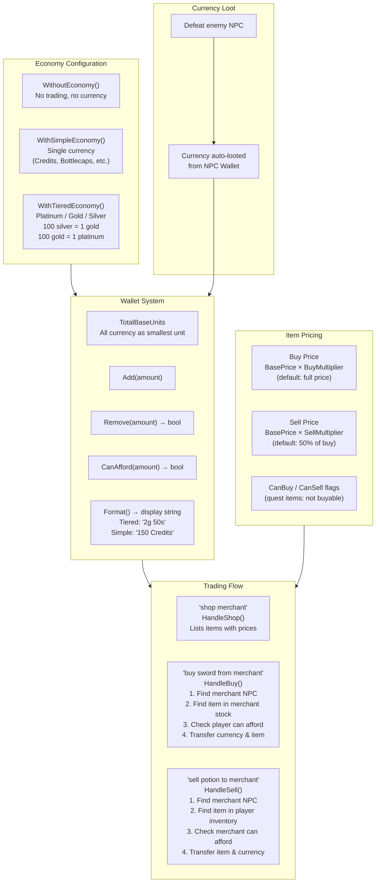

---

## 8. Crafting & Gathering System

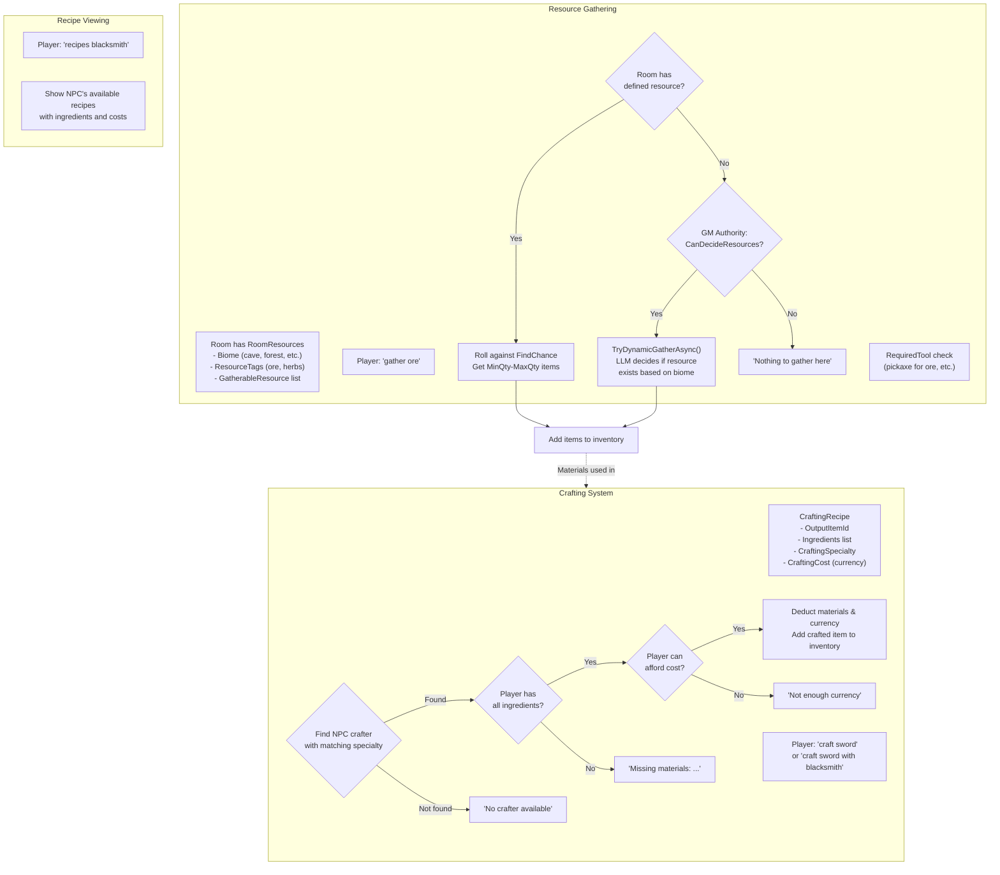

---

## 9. NPC Brain & Conversation System

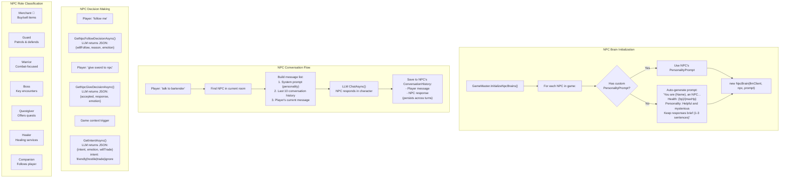

---

## 10. Program Startup & Mode Selection

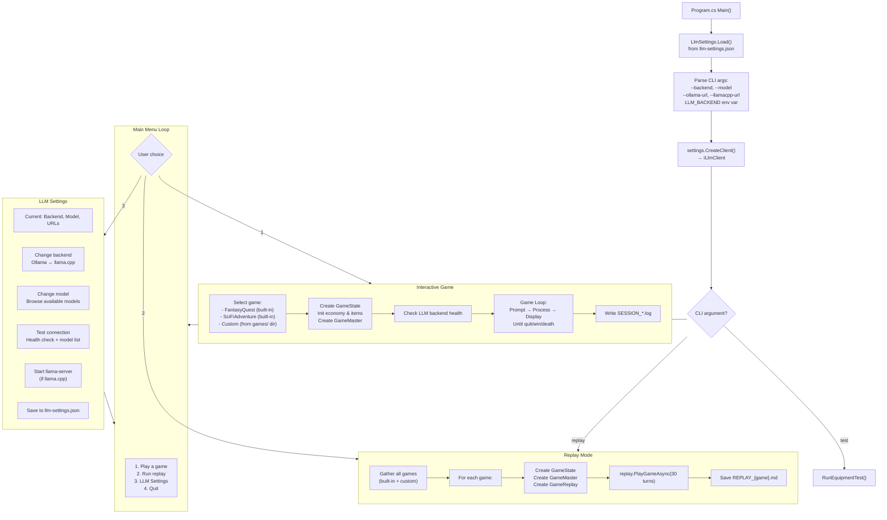

---

## 11. Quest System

```mermaid
flowchart LR
    subgraph Types["Quest Types"]
        Story["Story<br/>Main storyline"]
        Side["SideQuest<br/>Optional content"]
        Job["Job<br/>Repeatable tasks"]
        Bounty["Bounty<br/>Kill targets"]
        Craft["CraftingOrder<br/>Make items"]
        Escort["Escort<br/>Protect NPCs"]
        Explore["Exploration<br/>Find locations"]
        Deliver["Delivery<br/>Transport items"]
    end

    subgraph Lifecycle["Quest Lifecycle"]
        Offered["Offered<br/>NPC presents quest"]
        Accepted["Accepted<br/>Player takes quest"]
        InProgress["InProgress<br/>Working on it"]
        Completed["Completed<br/>Requirements met"]
        TurnedIn["TurnedIn<br/>Rewards claimed"]
        Failed["Failed<br/>Quest failed"]
    end

    subgraph Requirements["Requirement Types"]
        ItemReq["item<br/>Collect X of item"]
        KillReq["kill<br/>Defeat X enemies"]
        LocationReq["location<br/>Visit a room"]
        TalkReq["talk<br/>Speak to NPC"]
        CraftReq["craft<br/>Create an item"]
        GatherReq["gather<br/>Find materials"]
    end

    subgraph Rewards["Quest Rewards"]
        XP["Experience points"]
        Currency["Currency"]
        Items["Items"]
        Reputation["Reputation changes"]
        Recipes["Recipes learned"]
    end

    Offered --> Accepted --> InProgress --> Completed --> TurnedIn
    InProgress --> Failed
    Requirements --> InProgress
    TurnedIn --> Rewards
```

---

## 12. Game Definition Builder Pattern

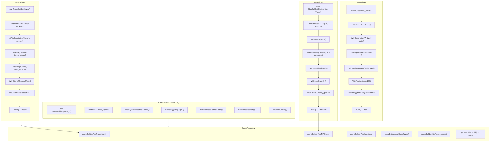

---

## 13. Complete Action Handler Map

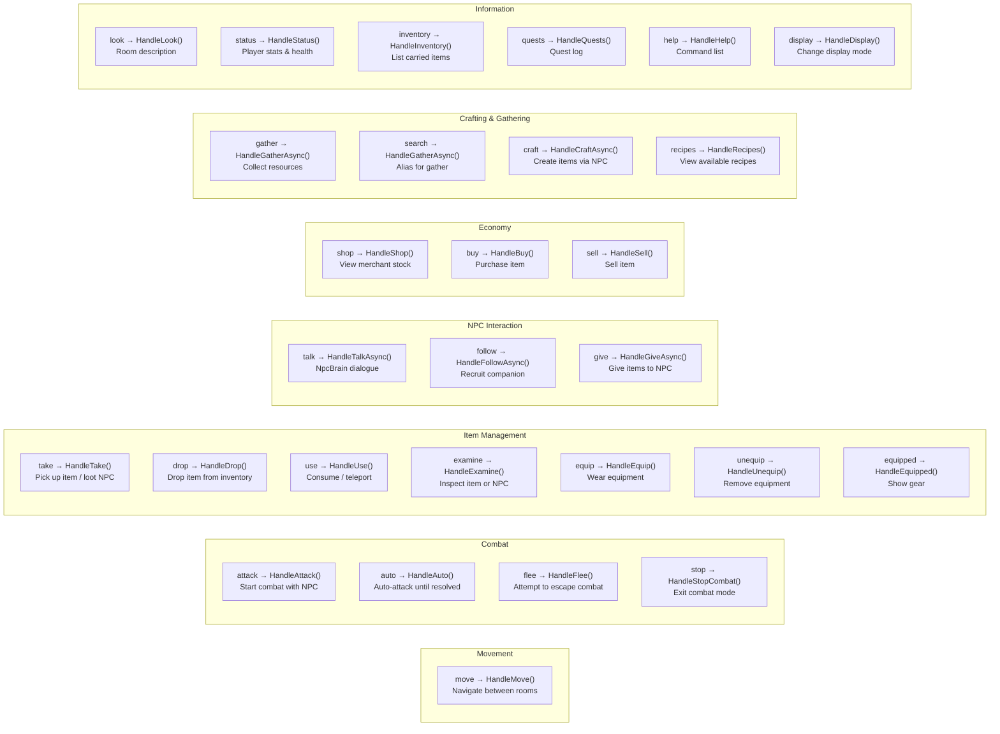

---

## 14. File Structure Overview

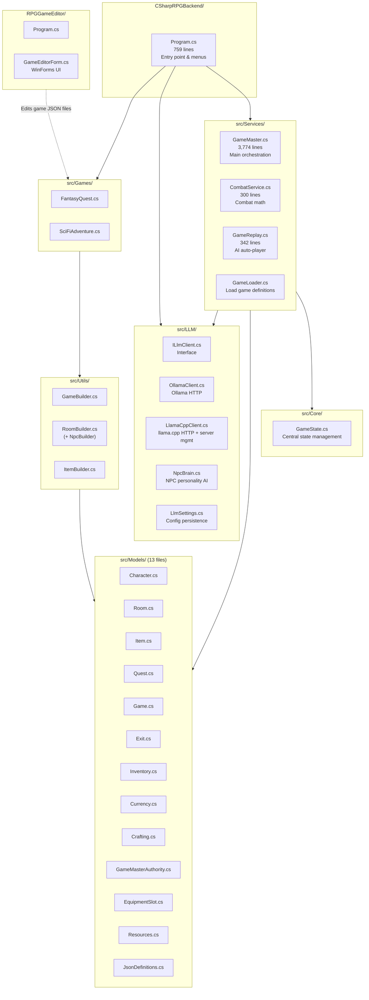
